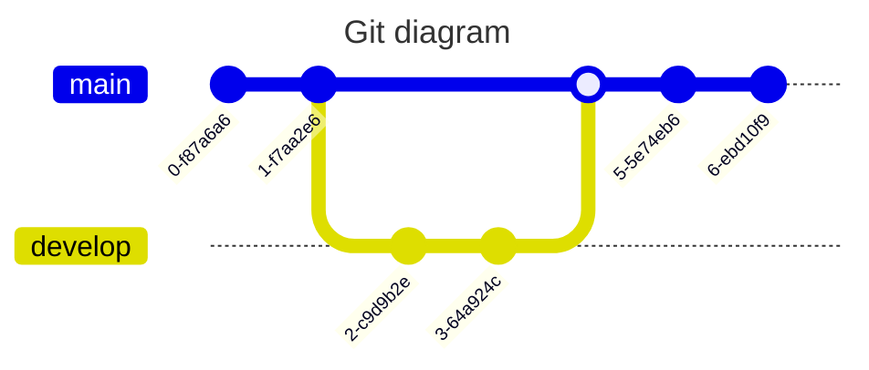
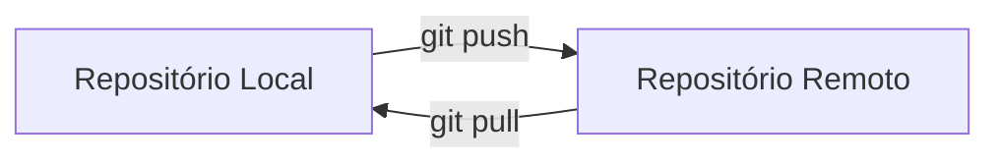

# Git e Github

### [Git](https://git-scm.com/)

Git é um sistema de controle de versão distribuído open-source criado por Linus Torvalds em 2005 para gerenciar o desenvolvimento do kernel Linux. 

---

### [Github](https://github.com/) é uma plataforma que permite o gerenciamento de projetos e portfólio.

GitHub é uma plataforma de hospedagem de código-fonte e colaboração baseada em Git, criada por Tom Preston-Werner, Chris Wanstrath, PJ Hyett e Scott Chacon em 2008. Atualmente, tem como proprietária a empresa Microsoft.

**Como usar**
- Criar conta no github
- Criar repositório pessoal
- Instalar git na sua máquina local
- Configurar chaves de acesso ao Github

**Aplicações**
- Gerenciar projetos
- Atuar colaborativamente
- Integrar Github e Colab

---

### 🕸️ [Github Pages](https://pages.github.com/)

Permite a criação de sites estáticos integrados a um repositório.

**Templates**

[Bootstrap Portfolio](https://bootstrapmade.com/bootstrap-portfolio-templates/) |
[Jekyll Themes](http://jekyllthemes.org/) |
[Github Themes](https://pages.github.com/themes/)

**Material suplementar**

[Git e Github explicado](https://www.youtube.com/playlist?list=PLhkO7OMKgT_rqwGYldqcFxyN4yjFgmDh8) |
[Github Alura](https://conteudo.alura.com.br/hubfs/B2C/Materiais%20ricos/Github_Tech_Compress_V2.pdf) |
[GitFichas](https://jtemporal.com/microlivrodegit/) |
[Markdown](https://www.markdownguide.org/) |
[Configurar SSH no Github](https://dev.to/dxwebster/como-conectar-ao-github-com-chaves-ssh-1i41#:~:text=Adicionar%20chave%20no%20Github&text=No%20campo%20%22T%C3%ADtulo%22%2C%20adicione,Add%20SSH%20key%22%20e%20pronto)

---
 ### :star: Aula prática
- [x] Criar repositório 
- [x] Vincular um notebook do colab ao repositório
- [x] Editar readme pessoal
- [x] Criar uma Página do Repositório

