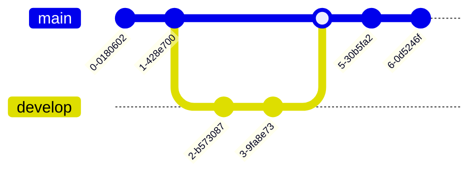

# Git e Github

Git é um sistema de controle de versão distribuído open-source criado por Linus Torvalds em 2005 para gerenciar o desenvolvimento do kernel Linux.

GitHub é uma plataforma de hospedagem de código-fonte e colaboração baseada em Git, criada por Tom Preston-Werner, Chris Wanstrath, PJ Hyett e Scott Chacon em 2008. Atualmente, tem como proprietária a empresa Microsoft.

Ao integrar Git e Github é possível combinar as funcionalidades de versionamento, compartilhamento de projetos e colaboração entre pessoas:

